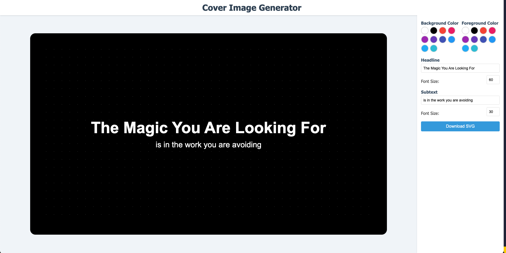
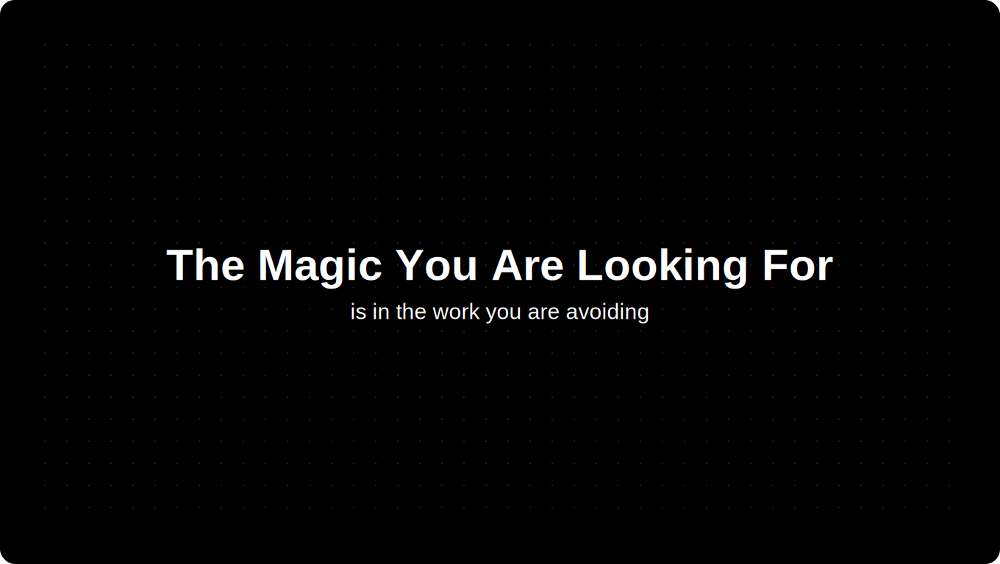

# SVG Blog Cover Image Generator

A minimal html/javascript page to generate a blog cover image with a title and a subtitle. You can customize the title, subtitle, the background color, foreground color, and the font size.

Generates image with the following dimensions:
_Width_: 1360px
_Height_: 768px

Effective for quickly generating blog cover images for your blog posts. Helps me a lot and images look great, feel free to modify and use it for your blog posts. And Yes i really tried to keep it minimal.
